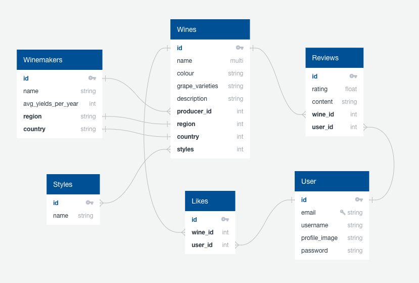

# WINO, a Python Django API and React app - GA Project Four

### The app has been deployed with Heroku and is available [here](http://winoaino.herokuapp.com/).

My final dev project for the Software Engineering Immersive course, a complex full-stack application built with Django REST Framework and React.

WINO is a Yelp-style social review site aimed for natural wine lovers, where users can write and read reviews of natural wines and learn more about the producers behind their favourite bottles. 


Please note that Heroku servers go to sleep after not receiving traffic for 1 hour, so the first request might take a moment as the servers wake up. Subsequent requests will perform normally.

## Brief & Timeframe:

* Build a full-stack application by making your own backend and your own front-end
* Use a Python Django API using Django REST Framework to serve your data from a Postgres database
* Consume your API with a separate front-end built with React
* Be a complete product which most likely means multiple relationships and CRUD functionality for at least a couple of models
* Implement thoughtful user stories/wireframes that are significant enough to help you know which features are core MVP and which you can cut
* Have a visually impressive design
* Be deployed online so it's publicly accessible
* Write your code DRY and build your APIs RESTful.
* Timeframe: 8 days

## Technologies Used:

* Django
* Django REST Framework
* PostgreSQL
* PyJWT
* JavaScript (ES6)
* React.js
* HTML, CSS, Sass
* Axios
* Git + GitHub
* react-notify-toast
* react-router-dom
* react-select

## Getting Started:

Click the Code button above to download the source code. In the terminal, enter the following commands:

<!— To install all the dependencies listed in the package.json: —> $ yarn 
<!- Navigate into the shell -> $ pipenv shell
<!— Run the app on localhost:8000 : —> $ python manage.py runserver
<!— Check the console for any issues and if there are any then check the package.json for any dependencies missing —>
<!- Navigate to http://localhost:8000/>

## Demonstration of the App Flow

#### Producers index


#### Producer show


#### Wine index


#### Wine show


#### In order to see or write reviews, user is then taken to the sign in / register page, based on their preference. After authentication, user has access to proceed to the reviews page. Here they can add their own reviews, and read reviews left by others:


### Functionality 

The functionality is not too different from other social review sites. Users can:

* Register & login
* View a curated feed of natural wine producers
* View a show-page of a producer
* View a curated feed of natural wines
* View a show-page of a wine
* Post, edit and delete reviews on natural wines

## Process

I started the design process by planning. First, I sketched out an Entity Relationship Diagram for the database architecture:



After I was happy with my ERD, I started fleshing out the front-end by creating wireframes of the main UI I wanted my app to have. Here are some examples, from <b>index</b>, <b>show</b> and <b>review</b>:

#### Wines Index

#### Wines Show

#### Review wine


I started the development process by building my models, views and serialisers in Django REST Framwork to create a SQL database with RESTful features. I spent a good three days building models as I wanted to ascertain that everything was working as I expected and the relationships I had planned were fit for purpose for the functionality I had designed. I used TablePlus to visualise my PostgreSQL database, and Insomnia REST Client to test my backend requests, making sure all relationships between models were correct and that I was receiving the expected JSON responses. 

By the start of day four, I was happy with the backend to the point where I was ready to move on to my front-end. I quickly bootstrapped together the main components: Home, Register, Login, Index, View. I used Axios for the data requests from the back-end, creating an API request library that was imported onto each relevant page. I used react-router-dom for page navigation. 
By this stage unfortunately, I became aware of rather a major flaw in my planning: I had taken on more than I could manage within the timeframe given. I had severely underestimated the time it would require to build the front-end for 6 models, and when the amount of my React components was skirting on 20, I had no choice but to choose my battles. I then decided to invest the time I had left to tying up loose ends, rather than trying to build new UI's for the functionality I had built in the backend.

### Styling

I wanted to challenge myself with the styling, so I decided to style everything completely from scratch without any help from CSS frameworks. In an attempt to make the site appear clean but with a hip flare, I opted for a B&W scheme with a colour pop of pastel pink, and a few sans-serif font options.

### Featured piece of code

In order to send the right information to the front-end, in this serialiser I'm populating my WineSerializer with data from different models with different SQL relationships - One-to-One (producer), Many-To-Many (styles) and One-To-Many (reviews). 

```python
from rest_framework import serializers
from .models import Wine
from winemakers.models import Winemaker 
from styles.serializers import StyleSerializer
from reviews.serializers import PopulatedReviewSerializer

class WineSerializer(serializers.ModelSerializer):

    class Meta:
        model = Wine
        fields = '__all__'

class ProducerSerializer(serializers.ModelSerializer):

    class Meta:
        model = Winemaker
        fields = ('id', 'name', 'country', 'region')

class PopulatedWineSerializer(WineSerializer):
    producer = ProducerSerializer()
    style = StyleSerializer(many=True)
    reviews = PopulatedReviewSerializer(many=True)
```

### Known bugs or errors

* The navigation menu does not close on re-render
* Error handling for forms has not been built
* Currently not able to edit reviews

### Wins and Blockers

Working out the SQL database relationships was a bit of a hurdle. Having previously worked with NoSQL databases only, I found it difficult to populate my serialisers in the right way to be able to send relevant data to the front-end, when some models had simultaneous One-To-Many and Many-To-Many relationships.

I'm very pleased with the seeds file I created to populate the app with some real-life data from the natural wine world. I also took this project as an opportunity to stretch my front-end developer muscles and set myself the ambitious goal to make pixel-perfect design, so having it turn out quite nice and slick was rewarding.

## Future Features

Some added functionality I would have liked to add if I had more time: 

* Search functionality with the ability to filter wines or producers by region, wine style etc.
* Users could like their favourite wines
* Maps to show geographical locations for different producers 
* Responsive design

## Key learnings

Going solo for the final project was definitely both a blessing and a curse, as it meant me miss out on some of the perks of collaborative work, such as bouncing ideas off team mates and sorting out any hurdles much sooner. On the flip side I'm happy that I decided to trust my ability to build a full-stack app on my own, as all the challenges I faced and was able to overcome in this project helped boost my confidence as a developer.

A big learning experience for me had to do with managing my own workload. I'm afraid I was overly confident about the time and effort that goes into building a full-stack app, and in a state of uninformed optimism, kept on adding new models to the backend to the point where I just couldn't build my front-end fast enough to cope with all the functionality. In the end, the project would have been big enough to keep a team of 3 developers well busy. I decided not to worry about this too much though, and instead focused on finishing what I could with the time that I had.
